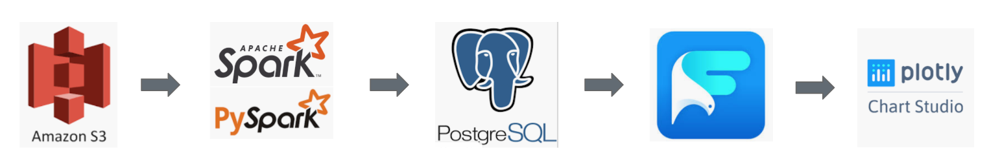
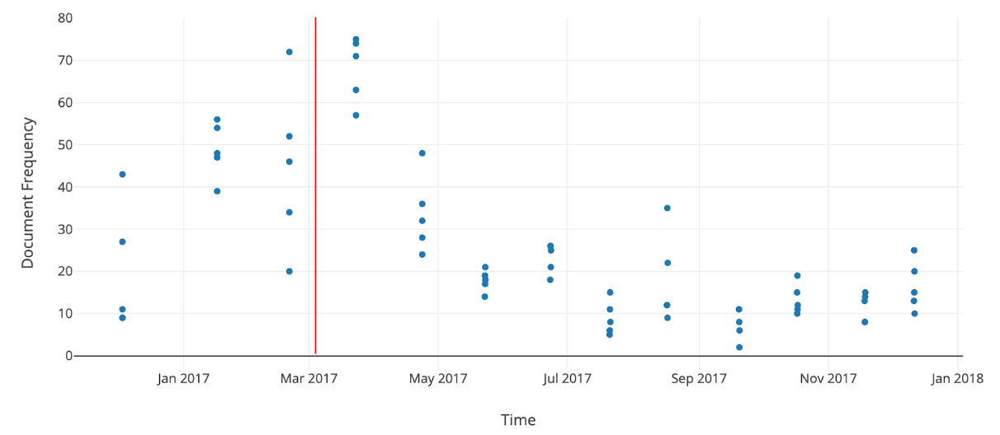
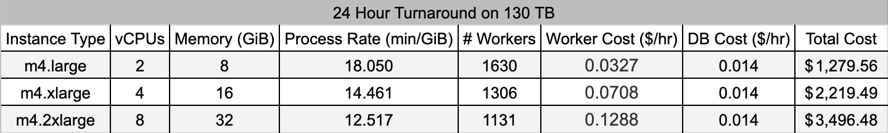
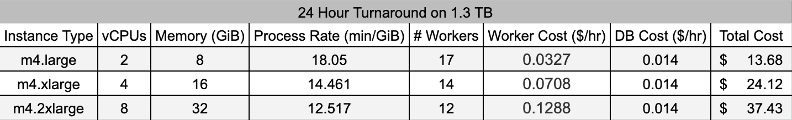

# The Archive Monitor

**Use raw internet data to gauge your online media footprint**

  

[Google Slides Presentation for The Archive Monitor](https://docs.google.com/presentation/d/1o3R8Odrkqcwbpp6PAXOucX0fcK6NtDUzxhY4cG0X4Yc/edit#slide=id.g7c92e72691_0_132)

  

  

## How to install and get it up and running

The tool was tested on a computing cluster comprised of Elastic Compute Cloud (EC2) instances. Development utilized Python (v3.5.2) and execution required Apache Hadoop (v2.7.6) and Apache Spark
(v2.4.0).  To start, clone the repository on the master node of your cluster, and type `python3 start.py` in the created directory. Copy the master node Public DNS (IPv4) to your clipboard to respond
to the prompt.

  

  

## Introduction

The tool utilizes the distributed-processing capabilities of Spark via the Python language to compute the term and document frequency of an entered search key across the publicly accessible Common 
Crawl archive over a time range requested by the user (restricted from December 2016 to the present). For now, the search only supports and matches characters in the ASCII encoding standard.

The frequency analysis code was borrowed from the open-source cc-pyspark project, which is a collection of useful PySpark tools that process Common Crawl data.  The repository for cc-pyspark is located 
[here](https://github.com/commoncrawl/cc-pyspark).

## Architecture

The data pipeline links the Common Crawl archive on Amazon S3 to the PySpark processor, which, in turn, links to a PostgreSQL database that stores the output. The database is then queried by the Falcon 
SQL Client by Plotly, which visualizes the data. Finally, the result is uploaded for display in a browser using Plotly Chart Studio.

  

## Dataset

The dataset is the publicly accessible Common Crawl internet archive, stored on Amazon S3. It contains plain text information and metadata describing the HTTP responses from billions of webpages. The 
archive is stored in three formats and updated monthly. The monthly data is accessible in terms of tens of thousands of compressed files (chunks), with the file paths collected in a single index file.

The data is inconsistent. Monthly data is not contiguous prior to December 2016. The size of the collected data varies from month to month. The number of timestamps and number of files associated with 
a timestamp also vary over this period.

## Testing

I chose to analyze a small amount of archive data centered on the March 3, 2017 release of the critically acclaimed title *The Legend of Zelda: Breath of the Wild*, developed and distributed by Nintendo.
Approximately 10 GB of data was processed, and the runtime was 3149 seconds.

## Engineering challenge

My challenge was a bottleneck that results from scaling the input. The response was to scale the cluster outward (by adding more workers) and upward (by allocating more resources to the workers). 
Conservative estimates for the number of workers required for a reasonable turnaround of 24 hours were obtained using the processing rate established through testing. Efforts to scale the cluster
upward were facilitated by the variety of instance types offered through AWS, although the impact on turnaround was marginal. Below is a table describing the results.

Moreover, testing suggested that trends are discernible by processing only a fraction of the available data. Turnaround estimates were significantly improved by restricting the ingestion to 1% of 
the available input, as shown below.

